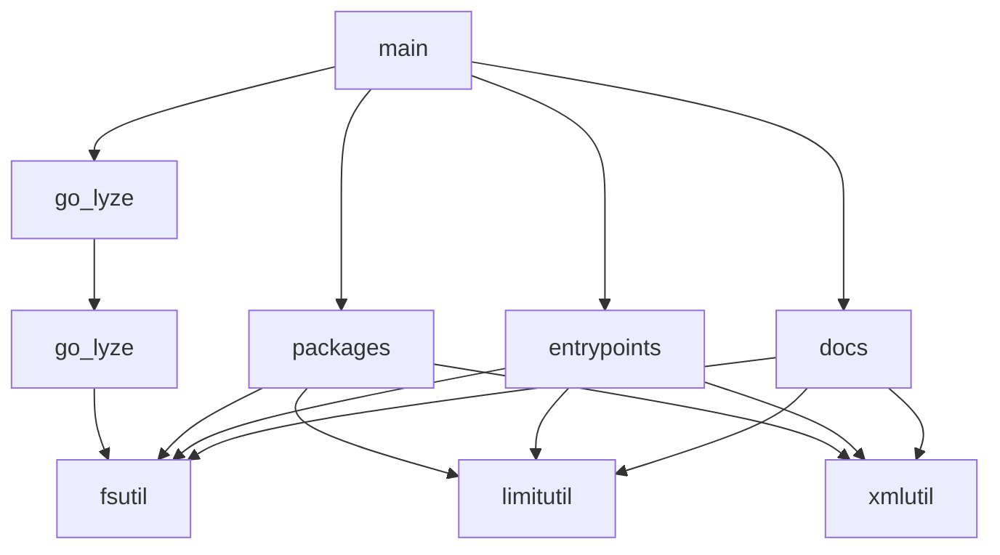
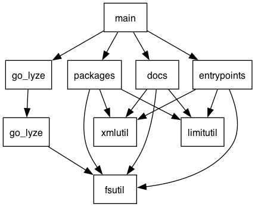
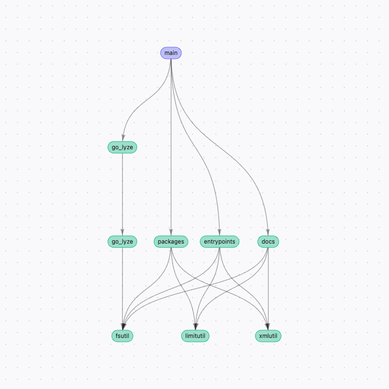
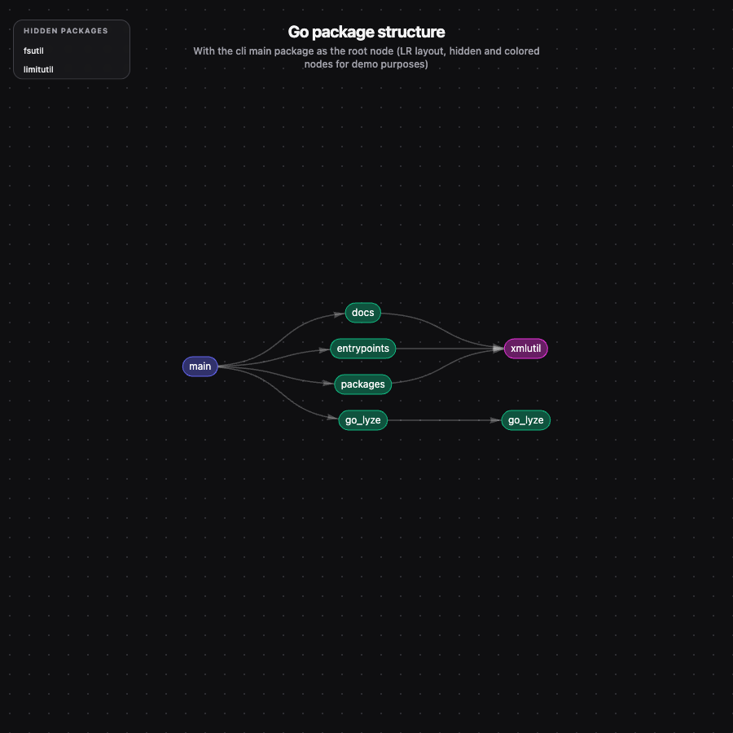

# Hooksh

A dumb working title for a little utility I'm playing around with.

## Install

```bash
go install github.com/fritzkeyzer/hooksh/cmd/hooksh@latest
```

## Examples

For more please see the `/demo` directory and [generate.sh](demo/generate.sh) 

### Go code graph as mermaid and dot output



> Note: To covert dot output to png you will need the `dot` cli.




### Interactive html and/or rendered html

The `hooksh` cli can generate a static html file with the graph data and configuration embedded.
To allow interactive browsing of the code structure.
See [interactive html](demo/graph.html) (open this in your browser or within your IDE)
You can zoom, pan, re-arrange nodes, hide nodes, change node colors, change light/dark mode, layout direction.

This rich html viewer can be rendered with the `--html-render` flag. Which uses a headless chromium instance to perform a screenshot.

**Default output:**



**With configuration:**
- dark mode
- layout (left-to-right vs top-down)
- title + subtitle
- hidden nodes and node colors
- render resolution



## XML Output commands

Some commands emit XML blocks.

Eg: `hooksh docs --kind md --limit 10`
```xml
<docs kind="md" limit="10">
./AGENTS.md
./backend/services/core/README.md
./docs/guidelines/ai-collaborators.md
./docs/guidelines/backend.md
./docs/guidelines/connectors.md
./docs/guidelines/frontend-stores.md
./docs/guidelines/frontend.md
./docs/guidelines/gen_go.md
./docs/guidelines/go.md
</docs>
```

Eg: `hooksh entrypoints --format call-tree --depth 2 --functions --exported-only`
```xml
<entrypoints format="call-tree" depth="2">
main.main
├── docs.Run
│   ├── fsutil.NormalizePath
│   ├── fsutil.Sorted
│   ├── fsutil.WalkFiles
│   ├── limitutil.CountOrLimit
│   ├── limitutil.EffectiveLimit
│   ├── xmlutil.TagClose
│   └── xmlutil.TagOpen
├── entrypoints.Run
│   ├── limitutil.CountOrLimit
│   ├── limitutil.EffectiveLimit
│   ├── xmlutil.TagClose
│   └── xmlutil.TagOpen
├── go_lyze.Run
│   ├── go_lyze.Analyze
│   ├── go_lyze.FormatDot
│   ├── go_lyze.FormatMarkdown
│   └── go_lyze.FormatMermaid
└── packages.Run
    ├── limitutil.CountOrLimit
    ├── limitutil.EffectiveLimit
    ├── xmlutil.TagClose
    └── xmlutil.TagOpen
</entrypoints>
```

Eg: `hooksh entrypoints --format call-tree --depth 2 --start "cmd/hooksh"`
```xml
<entrypoints format="call-tree" depth="2">
./cmd/hooksh
├── ./commands/packages
│   ├── ./internal/xmlutil
│   ├── ./internal/limitutil
│   └── ./internal/fsutil
├── ./commands/go_lyze
│   └── ./pkg/go_lyze
├── ./commands/entrypoints
│   ├── ./internal/xmlutil
│   ├── ./internal/limitutil
│   └── ./internal/fsutil
└── ./commands/docs
    ├── ./internal/xmlutil
    ├── ./internal/limitutil
    └── ./internal/fsutil
</entrypoints>
```

Eg: `hooksh packages --kind go-package-doc --limit 10 --order depth`
```xml
<packages kind="go-package-doc" count="7">
- hooksh: provides utilities for generating LLM-ready project context.
- md: provides utilities for indexing markdown files
- docs: lists documentation files for context bootstrapping.
- entrypoints: prints a main package or function call tree.
- go_lyze: analyzes a Go codebase via AST parsing and returns structured data about packages, their exports, and cross-package call relationships.
- go_lyze: provides the go-lyze CLI command.
- packages: lists project packages with their package docs.
</packages>
```


